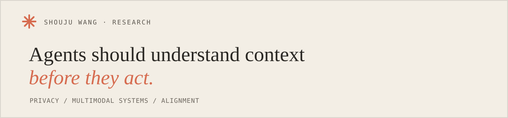

  

  <a href="https://voidreaming.github.io/shouju-wang.github.io/">Website</a>
  &nbsp;&nbsp;·&nbsp;&nbsp;
  <a href="https://scholar.google.com/citations?user=ut74MgsAAAAJ">Google Scholar</a>
  &nbsp;&nbsp;·&nbsp;&nbsp;
  <a href="https://www.linkedin.com/in/shouju-wang-4b030a385/">LinkedIn</a>
  &nbsp;&nbsp;·&nbsp;&nbsp;
  <a href="mailto:shoujuw@hawaii.edu">Email</a>

### About

I'm a Computer Science Ph.D. student at the University of Hawaiʻi at Mānoa. My research asks how AI agents can remain useful while respecting privacy, social context, and human intent.

### Selected work

- **[MPCI-Bench](https://arxiv.org/abs/2601.08235)** — multimodal contextual integrity for language-model agents
- **[Privacy in Action](https://aclanthology.org/2025.findings-emnlp.925/)** — practical privacy safeguards for LLM agents · *EMNLP 2025 Findings*
- **[DECAF-GAD](https://arxiv.org/abs/2508.10785)** — fair graph anomaly detection · *ECAI 2025 Oral*
