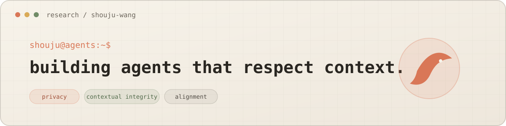

  

I'm a Computer Science Ph.D. student at the University of Hawaiʻi at Mānoa, advised by Prof. Haopeng Zhang. I study how AI agents can remain useful while respecting privacy, social context, and human intent.

### Research

`contextual integrity` · `multimodal agents` · `privacy & safety` · `agent alignment`

My current work develops realistic evaluations and practical safeguards for language-model agents. I previously worked on agent privacy at Microsoft Research Asia and fair graph learning at Duke Kunshan University.

### Selected work

- **[MPCI-Bench](https://arxiv.org/abs/2601.08235)** — multimodal pairwise contextual integrity for language-model agents
- **[Privacy in Action](https://aclanthology.org/2025.findings-emnlp.925/)** — realistic privacy mitigation and evaluation for LLM agents · *EMNLP 2025 Findings*
- **[DECAF-GAD](https://arxiv.org/abs/2508.10785)** — fair autoencoders for graph anomaly detection · *ECAI 2025 Oral*

  <a href="https://voidreaming.github.io/shouju-wang.github.io/">website</a>
  &nbsp;·&nbsp;
  <a href="https://scholar.google.com/citations?user=ut74MgsAAAAJ">scholar</a>
  &nbsp;·&nbsp;
  <a href="https://www.linkedin.com/in/shouju-wang-4b030a385/">linkedin</a>
  &nbsp;·&nbsp;
  <a href="mailto:shoujuw@hawaii.edu">email</a>

